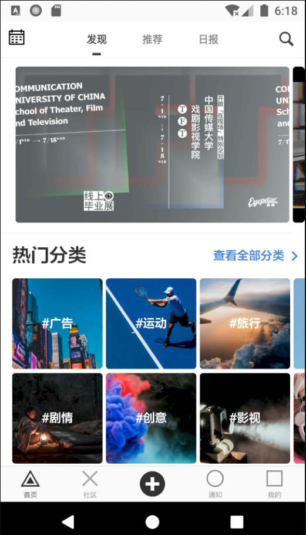

# Eye

基于 [Kotlin](https://kotlinlang.org/) 语言仿写「[开眼 Eyepetizer](https://www.kaiyanapp.com/)」的一个短视频 Android 客户端项目，采用 [Jetpack](https://developer.android.com/jetpack) + [协程](https://github.com/Kotlin/kotlinx.coroutines)实现的 MVVM 架构。

## 简介

这是一个仿「[开眼 Eyepetizer][2]」的短视频 Android 客户端项目，通过此项目，进行相关技术的学习和整合

## 屏幕截图

## 主要功能

- 观看优质高清短视频与评论。
- 浏览社区图文与视频创作。
- 查看每日新鲜资讯与热搜关键词。
- 分享精彩短视频与新鲜资讯等。

## 鼓励

通过这个项目希望能够更好地学习 Jetpack 与 MVVM 架构。

## 致谢

- [Retrofit][14] 网络请求框架封装
- [Glide][15] 图片加载
- [OkHttp][16] 网络请求
- [Gson][17] Gson 解析
- [Glide Transformations][18] 图像转换
- [Eventbus][19] 事件总线
- [Permissionx][20] 动态请求权限封装
- [FlycoTabLayout][21] TabLayout封装
- [SmartRefreshLayout][22] 下拉刷新框架
- [BannerViewPager][23] Banner轮播图
- [Immersionbar][24] 状态栏管理
- [PhotoView][25] 支持手势缩放图片
- [Circleimageview][26] 圆形图像
- [GSYVideoPlayer][27] 视频播放器
- [VasSonic][28] 提升H5首屏加载速度
- [Kotlinx Coroutines][30] 简化代码管理后台线程与回调

## License

所有数据来源于开眼，仅供学习和交流使用，严禁用于任何商业用途，原作公司拥有所有权利。**